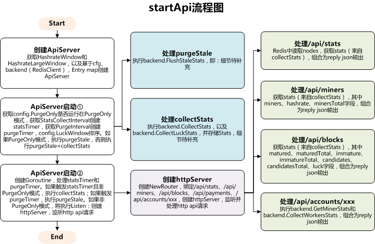

# open-ethereum-pool以太坊矿池-api模块

## ApiServer相关定义

```go
type ApiConfig struct {
        Enabled              bool   `json:"enabled"`
        Listen               string `json:"listen"`
        StatsCollectInterval string `json:"statsCollectInterval"`
        HashrateWindow       string `json:"hashrateWindow"`
        HashrateLargeWindow  string `json:"hashrateLargeWindow"`
        LuckWindow           []int  `json:"luckWindow"`
        Payments             int64  `json:"payments"`
        Blocks               int64  `json:"blocks"`
        PurgeOnly            bool   `json:"purgeOnly"`
        PurgeInterval        string `json:"purgeInterval"`
}

type ApiServer struct {
        config              *ApiConfig
        backend             *storage.RedisClient
        hashrateWindow      time.Duration
        hashrateLargeWindow time.Duration
        stats               atomic.Value
        miners              map[string]*Entry
        minersMu            sync.RWMutex
        statsIntv           time.Duration
}

type Entry struct {
        stats     map[string]interface{}
        updatedAt int64
}
//代码位置api/server.go
```

## startApi流程图



## CollectStats原理

```go
//config.StatsCollectInterval为CollectStats定时器，时间为5秒
//调取：stats, err := s.backend.CollectStats(s.hashrateWindow, s.config.Blocks, s.config.Payments)
//s.hashrateWindow即cfg.HashrateWindow，即：为每个矿工估计算力的快速时间间隔，30分钟
//s.config.Blocks即：前端显示的最大块数，50个
//s.config.Payments即：前端显示的最大付款数量，50个
func (r *RedisClient) CollectStats(smallWindow time.Duration, maxBlocks, maxPayments int64) (map[string]interface{}, error) {
	//换算成秒
	window := int64(smallWindow / time.Second)
	//创建map
	stats := make(map[string]interface{})

	//Redis事务块
	tx := r.client.Multi()
	defer tx.Close()

	//换算成秒
	now := util.MakeTimestamp() / 1000

	cmds, err := tx.Exec(func() error {
		//针对min和max参数需要额外说明的是，-inf和+inf分别表示Sorted-Sets中分数的最高值和最低值
		//缺省情况下，min和max表示的范围是闭区间范围，即min <= score <= max内的成员将被返回
		//然而我们可以通过在min和max的前面添加"("字符来表示开区间，如(min max表示min < score <= max，而(min (max表示min < score < max
		//-inf <= score < now-window
		
		//Zremrangebyscore 命令用于移除有序集中，指定分数（score）区间内的所有成员
		//ZREMRANGEBYSCORE eth:hashrate -inf (now-window
		//慎重使用
		tx.ZRemRangeByScore(r.formatKey("hashrate"), "-inf", fmt.Sprint("(", now-window))
		
		//显示整个有序集成员
		//ZRANGE eth:hashrate 0 -1 WITHSCORES
		tx.ZRangeWithScores(r.formatKey("hashrate"), 0, -1)
		
		//Hgetall 命令用于返回哈希表中，所有的字段和值
		//HGETALL eth:stats
		tx.HGetAllMap(r.formatKey("stats"))
		
		//Zrevrange 命令返回有序集中，指定区间内的成员
		//ZREVRANGE eth:blocks:candidates 0 -1 WITHSCORES
		//candidates为候选者
		tx.ZRevRangeWithScores(r.formatKey("blocks", "candidates"), 0, -1)
		
		//同上
		//ZREVRANGE eth:blocks:immature 0 -1 WITHSCORES
		//immature为未成年
		tx.ZRevRangeWithScores(r.formatKey("blocks", "immature"), 0, -1)
		
		//同上
		//ZREVRANGE eth:blocks:matured 0 49 WITHSCORES
		//matured为成熟
		tx.ZRevRangeWithScores(r.formatKey("blocks", "matured"), 0, maxBlocks-1)
		
		//Zcard 命令用于计算集合中元素的数量
		//ZCARD eth:blocks:candidates
		tx.ZCard(r.formatKey("blocks", "candidates"))
		
		//同上
		//ZCARD eth:blocks:immature
		tx.ZCard(r.formatKey("blocks", "immature"))
		
		//同上
		//ZCARD eth:blocks:matured
		tx.ZCard(r.formatKey("blocks", "matured"))
		
		//同上
		//ZCARD eth:payments:all
		tx.ZCard(r.formatKey("payments", "all"))
		
		//同上
		//ZREVRANGE eth:payments:all 0 49 WITHSCORES
		tx.ZRevRangeWithScores(r.formatKey("payments", "all"), 0, maxPayments-1)
		return nil
	})

	if err != nil {
		return nil, err
	}

	//Hgetall 命令用于返回哈希表中，所有的字段和值
	//HGETALL eth:stats
	result, _ := cmds[2].(*redis.StringStringMapCmd).Result()
	stats["stats"] = convertStringMap(result)
	
	//Zrevrange 命令返回有序集中，指定区间内的成员
	//ZREVRANGE eth:blocks:candidates 0 -1 WITHSCORES
	//Zcard 命令用于计算集合中元素的数量
	//ZCARD eth:blocks:candidates
	candidates := convertCandidateResults(cmds[3].(*redis.ZSliceCmd))
	stats["candidates"] = candidates
	stats["candidatesTotal"] = cmds[6].(*redis.IntCmd).Val()

	//ZREVRANGE eth:blocks:immature 0 -1 WITHSCORES
	//ZCARD eth:blocks:immature
	immature := convertBlockResults(cmds[4].(*redis.ZSliceCmd))
	stats["immature"] = immature
	stats["immatureTotal"] = cmds[7].(*redis.IntCmd).Val()

	//ZREVRANGE eth:blocks:matured 0 49 WITHSCORES
	//ZCARD eth:blocks:matured
	matured := convertBlockResults(cmds[5].(*redis.ZSliceCmd))
	stats["matured"] = matured
	stats["maturedTotal"] = cmds[8].(*redis.IntCmd).Val()

	//ZREVRANGE eth:payments:all 0 49 WITHSCORES
	//ZCARD eth:payments:all
	payments := convertPaymentsResults(cmds[10].(*redis.ZSliceCmd))
	stats["payments"] = payments
	stats["paymentsTotal"] = cmds[9].(*redis.IntCmd).Val()

	//显示整个有序集成员
	//ZRANGE eth:hashrate 0 -1 WITHSCORES
	totalHashrate, miners := convertMinersStats(window, cmds[1].(*redis.ZSliceCmd))
	stats["miners"] = miners
	stats["minersTotal"] = len(miners)
	stats["hashrate"] = totalHashrate
	return stats, nil
}
```

## CollectLuckStats原理

```go
//调取：stats["luck"], err = s.backend.CollectLuckStats(s.config.LuckWindow)
//"luckWindow": [64, 128, 256],
//Collect stats for shares/diff ratio for this number of blocks
func (r *RedisClient) CollectLuckStats(windows []int) (map[string]interface{}, error) {
	//创建stats map
	stats := make(map[string]interface{})

	tx := r.client.Multi()
	defer tx.Close()

	//max即256
	max := int64(windows[len(windows)-1])

	cmds, err := tx.Exec(func() error {
		//Zrevrange 命令返回有序集中，指定区间内的成员
		//ZREVRANGE eth:blocks:immature 0 -1 WITHSCORES
		tx.ZRevRangeWithScores(r.formatKey("blocks", "immature"), 0, -1)
		
		//ZREVRANGE eth:blocks:matured 0 max-1 WITHSCORES
		tx.ZRevRangeWithScores(r.formatKey("blocks", "matured"), 0, max-1)
		return nil
	})
	if err != nil {
		return stats, err
	}
	//获取blocks
	blocks := convertBlockResults(cmds[0].(*redis.ZSliceCmd), cmds[1].(*redis.ZSliceCmd))

	calcLuck := func(max int) (int, float64, float64, float64) {
		var total int
		var sharesDiff, uncles, orphans float64
		for i, block := range blocks {
			if i > (max - 1) {
				break
			}
			//叔块
			if block.Uncle {
				uncles++
			}
			//孤块
			if block.Orphan {
				orphans++
			}
			//shares/Diff
			sharesDiff += float64(block.TotalShares) / float64(block.Difficulty)
			//total计数
			total++
		}
		if total > 0 {
			//单块平均shares/Diff
			sharesDiff /= float64(total)
			//uncles率
			uncles /= float64(total)
			//孤块率
			orphans /= float64(total)
		}
		//返回total计数，平均shares/Diff，uncles率，孤块率
		return total, sharesDiff, uncles, orphans
	}
	
	//遍历windows，逐一计算calcLuck，即最近64块、128块、256块的数据统计
	for _, max := range windows {
		total, sharesDiff, uncleRate, orphanRate := calcLuck(max)
		row := map[string]float64{
			"luck": sharesDiff, "uncleRate": uncleRate, "orphanRate": orphanRate,
		}
		//写入stats map
		stats[strconv.Itoa(total)] = row
		//计数不对
		if total < max {
			break
		}
	}
	return stats, nil
}

func convertBlockResults(rows ...*redis.ZSliceCmd) []*BlockData {
	var result []*BlockData
	//遍历rows
	for _, row := range rows {
		//遍历blocks
		for _, v := range row.Val() {
			// "uncleHeight:orphan:nonce:blockHash:timestamp:diff:totalShares:rewardInWei"
			block := BlockData{}
			block.Height = int64(v.Score)
			block.RoundHeight = block.Height
			fields := strings.Split(v.Member.(string), ":")
			block.UncleHeight, _ = strconv.ParseInt(fields[0], 10, 64)
			block.Uncle = block.UncleHeight > 0
			block.Orphan, _ = strconv.ParseBool(fields[1])
			block.Nonce = fields[2]
			block.Hash = fields[3]
			block.Timestamp, _ = strconv.ParseInt(fields[4], 10, 64)
			block.Difficulty, _ = strconv.ParseInt(fields[5], 10, 64)
			block.TotalShares, _ = strconv.ParseInt(fields[6], 10, 64)
			block.RewardString = fields[7]
			block.ImmatureReward = fields[7]
			block.immatureKey = v.Member.(string)
			result = append(result, &block)
		}
	}
	return result
}
```

## purgeStale原理

```go
//config.PurgeInterval为FlushStaleStats定时器，时间为10分钟
//调取：total, err := s.backend.FlushStaleStats(s.hashrateWindow, s.hashrateLargeWindow)
//s.hashrateWindow即cfg.HashrateWindow，即：为每个矿工估计算力的快速时间间隔，30分钟
//s.hashrateLargeWindow即cfg.HashrateLargeWindow，即：长期和精确的hashrate时间间隔，3小时
func (r *RedisClient) FlushStaleStats(window, largeWindow time.Duration) (int64, error) {
	//换算成秒
	now := util.MakeTimestamp() / 1000
	
	//max即(now-window，即<(now-window
	max := fmt.Sprint("(", now-int64(window/time.Second))
	
	//Zremrangebyscore 命令用于移除有序集中，指定分数（score）区间内的所有成员
	//ZREMRANGEBYSCORE eth:hashrate -inf (now-window
	//慎重使用
	total, err := r.client.ZRemRangeByScore(r.formatKey("hashrate"), "-inf", max).Result()
	if err != nil {
		return total, err
	}

	var c int64
	//创建map
	miners := make(map[string]struct{})
	//即(now-largeWindow，即<now-largeWindow
	max = fmt.Sprint("(", now-int64(largeWindow/time.Second))

	for {
		var keys []string
		var err error
		
		//SCAN 命令用于迭代当前数据库中的数据库键
		//SCAN 0 MATCH eth:hashrate:* COUNT 100
		//SCAN c MATCH eth:hashrate:* COUNT 100
		c, keys, err = r.client.Scan(c, r.formatKey("hashrate", "*"), 100).Result()
		if err != nil {
			return total, err
		}
		for _, row := range keys {
			//eth:hashrate:login中截取login
			login := strings.Split(row, ":")[2]
			//没有处理过miners[login]
			if _, ok := miners[login]; !ok {
				//Zremrangebyscore 命令用于移除有序集中，指定分数（score）区间内的所有成员
				//ZREMRANGEBYSCORE eth:hashrate:login -inf (now-window
				n, err := r.client.ZRemRangeByScore(r.formatKey("hashrate", login), "-inf", max).Result()
				if err != nil {
					return total, err
				}
				//已处理的计入miners[login]
				miners[login] = struct{}{}
				//已处理的数量
				total += n
			}
		}
		if c == 0 {
			break
		}
	}
	return total, nil
}
```

## 参考文档

* [gopkg.in/redis.v3](https://godoc.org/gopkg.in/redis.v3)
* [Redis学习手册(Sorted-Sets数据类型)](https://www.cnblogs.com/stephen-liu74/archive/2012/03/23/2354994.html)
* [Redis Command 命令](http://www.runoob.com/redis/server-command.html)