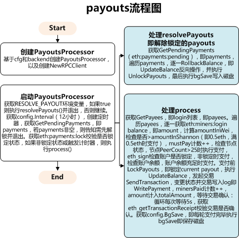

# open-ethereum-pool以太坊矿池-payouts模块

## PayoutsProcessor定义

```go
type PayoutsProcessor struct {
	config   *PayoutsConfig
	backend  *storage.RedisClient
	rpc      *rpc.RPCClient
	halt     bool
	lastFail error
}
```

## payouts流程图



## GetPendingPayments原理

```go
func (r *RedisClient) GetPendingPayments() []*PendingPayment {
	//ZREVRANGE eth:payments:pending 0 -1 WITHSCORES
	raw := r.client.ZRevRangeWithScores(r.formatKey("payments", "pending"), 0, -1)
	var result []*PendingPayment
	for _, v := range raw.Val() {
		// timestamp -> "address:amount"
		payment := PendingPayment{}
		payment.Timestamp = int64(v.Score)
		fields := strings.Split(v.Member.(string), ":")
		payment.Address = fields[0]
		payment.Amount, _ = strconv.ParseInt(fields[1], 10, 64)
		result = append(result, &payment)
	}
	return result
}
```

## GetPayees原理

```go
func (r *RedisClient) GetPayees() ([]string, error) {
	payees := make(map[string]struct{})
	var result []string
	var c int64

	for {
		var keys []string
		var err error
		c, keys, err = r.client.Scan(c, r.formatKey("miners", "*"), 100).Result()
		if err != nil {
			return nil, err
		}
		for _, row := range keys {
			login := strings.Split(row, ":")[2]
			payees[login] = struct{}{}
		}
		if c == 0 {
			break
		}
	}
	for login, _ := range payees {
		result = append(result, login)
	}
	return result, nil
}
```

## LockPayouts原理

```go
func (r *RedisClient) LockPayouts(login string, amount int64) error {
	//eth:payments:lock
	key := r.formatKey("payments", "lock")
	
	//SETNX eth:payments:lock login:amount 0
	//Setnx（SET if Not eXists） 命令在指定的 key 不存在时，为 key 设置指定的值
	result := r.client.SetNX(key, join(login, amount), 0).Val()
	if !result {
		return fmt.Errorf("Unable to acquire lock '%s'", key)
	}
	return nil
}
```

## UpdateBalance原理

```go
func (r *RedisClient) UpdateBalance(login string, amount int64) error {
        tx := r.client.Multi()
        defer tx.Close()

        ts := util.MakeTimestamp() / 1000

        _, err := tx.Exec(func() error {
				//Hincrby 命令用于为哈希表中的字段值加上指定增量值
				//HINCRBY eth:miners:login balance -amount
                tx.HIncrBy(r.formatKey("miners", login), "balance", (amount * -1))
				
				//HINCRBY eth:miners:login pending amount
                tx.HIncrBy(r.formatKey("miners", login), "pending", amount)
				
				//HINCRBY eth:finances balance -amount
                tx.HIncrBy(r.formatKey("finances"), "balance", (amount * -1))
				
				//HINCRBY eth:finances pending amount
                tx.HIncrBy(r.formatKey("finances"), "pending", amount)
				
				//ZADD eth:payments:pending ts login:amount
				//Zadd 命令用于将一个或多个成员元素及其分数值加入到有序集当中
                tx.ZAdd(r.formatKey("payments", "pending"), redis.Z{Score: float64(ts), Member: join(login, amount)})
                return nil
        })
        return err
}
```

## RollbackBalance原理

```go
func (r *RedisClient) RollbackBalance(login string, amount int64) error {
	tx := r.client.Multi()
	defer tx.Close()

	_, err := tx.Exec(func() error {
		tx.HIncrBy(r.formatKey("miners", login), "balance", amount)
		tx.HIncrBy(r.formatKey("miners", login), "pending", (amount * -1))
		tx.HIncrBy(r.formatKey("finances"), "balance", amount)
		tx.HIncrBy(r.formatKey("finances"), "pending", (amount * -1))
		tx.ZRem(r.formatKey("payments", "pending"), join(login, amount))
		return nil
	})
	return err
}
```

## WritePayment原理

```go
func (r *RedisClient) WritePayment(login, txHash string, amount int64) error {
	tx := r.client.Multi()
	defer tx.Close()

	ts := util.MakeTimestamp() / 1000

	_, err := tx.Exec(func() error {
		//HINCRBY eth:miners:login pending -amount
		tx.HIncrBy(r.formatKey("miners", login), "pending", (amount * -1))
		
		//HINCRBY eth:miners:login paid amount
		tx.HIncrBy(r.formatKey("miners", login), "paid", amount)
		
		//HINCRBY eth:finances pending -amount
		tx.HIncrBy(r.formatKey("finances"), "pending", (amount * -1))
		
		//HINCRBY eth:finances paid amount
		tx.HIncrBy(r.formatKey("finances"), "paid", amount)
		
		//ZADD eth:payments:all ts txHash:login:amount
		tx.ZAdd(r.formatKey("payments", "all"), redis.Z{Score: float64(ts), Member: join(txHash, login, amount)})
		
		//ZADD eth:payments:login ts txHash:amount
		tx.ZAdd(r.formatKey("payments", login), redis.Z{Score: float64(ts), Member: join(txHash, amount)})
		
		//ZREM eth:payments:pending login:amount
		//Zrem 命令 Redis 有序集合(sorted set) Redis Zrem 命令用于移除有序集中的一个或多个成员
		tx.ZRem(r.formatKey("payments", "pending"), join(login, amount))
		
		//DEL 命令用于删除已存在的键
		//DEL eth:payments:lock
		tx.Del(r.formatKey("payments", "lock"))
		return nil
	})
	return err
}
```