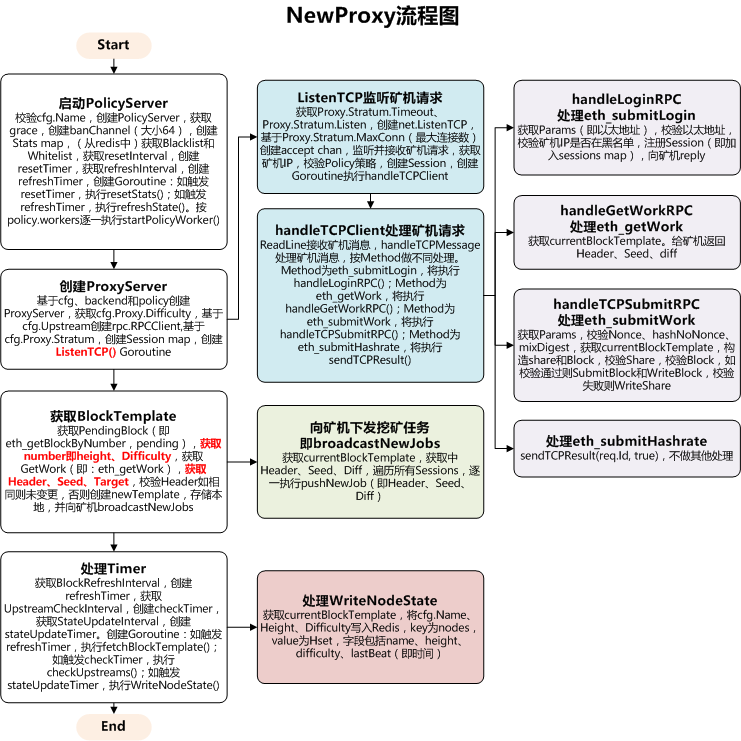

# open-ethereum-pool以太坊矿池-proxy模块

## ProxyServer定义

```go
type ProxyServer struct {
        config             *Config
        blockTemplate      atomic.Value
        upstream           int32
        upstreams          []*rpc.RPCClient
        backend            *storage.RedisClient
        diff               string
        policy             *policy.PolicyServer
        hashrateExpiration time.Duration
        failsCount         int64

        // Stratum
        sessionsMu sync.RWMutex
        sessions   map[*Session]struct{}
        timeout    time.Duration
}
```

## 以太坊Pow算法原理

```
//以太坊Pow算法可以表示为如下公式：
//RAND(h, n) <= M / d
//其中RAND()表示一个概念函数，代表一系列的复杂运算。 其中h和n为输入，即区块Header的哈希、以及Header中的Nonce。 
//M表示一个极大的数，此处使用2^256-1。 d，为区块难度，即Header中的Difficulty。

//因此在h和n确定的情况下，d越大，挖矿难度越大，即为Difficulty本义。 即不断变更Nonce，使RAND(h, n)满足RAND(h, n) <= M / d，即完成Pow。
```

## NewProxy流程图



## Stratum Mining Protocol

### eth_submitLogin

```json
//Request
{
  "id": 1,
  "jsonrpc": "2.0",
  "method": "eth_submitLogin",
  "params": ["0xb85150eb365e7df0941f0cf08235f987ba91506a"]
}
//或
{
  "id": 1,
  "jsonrpc": "2.0",
  "method": "eth_submitLogin",
  "params": ["0xb85150eb365e7df0941f0cf08235f987ba91506a", "admin@example.net"]
}

//Successful response
{ "id": 1, "jsonrpc": "2.0", "result": true }

//{ "id": 1, "jsonrpc": "2.0", "result": null, "error": { code: -1, message: "Invalid login" } }
```

### eth_getWork

```json
//Request 
{ "id": 1, "jsonrpc": "2.0", "method": "eth_getWork" }

//Successful response
{
  "id": 1,
  "jsonrpc": "2.0",
  "result": [
      "0x1234567890abcdef1234567890abcdef1234567890abcdef1234567890abcdef",
      "0x5eed00000000000000000000000000005eed0000000000000000000000000000",
      "0xd1ff1c01710000000000000000000000d1ff1c01710000000000000000000000"
    ]
}

//Exceptions
{ "id": 10, "result": null, "error": { code: 0, message: "Work not ready" } }
```

### New Job Notification

```json
//New Job Notification
{
  "jsonrpc": "2.0",
  "result": [
      "0x1234567890abcdef1234567890abcdef1234567890abcdef1234567890abcdef",
      "0x5eed00000000000000000000000000005eed0000000000000000000000000000",
      "0xd1ff1c01710000000000000000000000d1ff1c01710000000000000000000000"
    ]
}
```

### eth_submitWork

```json
//Request 
{
  "id": 1,
  "jsonrpc": "2.0",
  "method": "eth_submitWork",
  "params": [
    "0xe05d1fd4002d962f",
    "0x6c872e2304cd1e64b553a65387d7383470f22331aff288cbce5748dc430f016a",
    "0x2b20a6c641ed155b893ee750ef90ec3be5d24736d16838b84759385b6724220d"
  ]
}

//Response
{ "id": 1, "jsonrpc": "2.0", "result": true }
{ "id": 1, "jsonrpc": "2.0", "result": false }

//Exceptions
{ "id": 1, "jsonrpc": "2.0", "result": null, "error": { code: 23, message: "Invalid share" } }
{ "id": 1, "jsonrpc": "2.0", "result": null, "error": { code: 22, message: "Duplicate share" } }
{ "id": 1, "jsonrpc": "2.0", "result": null, "error": { code: -1, message: "High rate of invalid shares" } }
{ "id": 1, "jsonrpc": "2.0", "result": null, "error": { code: 25, message: "Not subscribed" } }
{ "id": 1, "jsonrpc": "2.0", "result": null, "error": { code: -1, message: "Malformed PoW result" } }
```

### Submit Hashrate

```json
{ "id": 1, "jsonrpc": "2.0", "result": true }
```

## Geth JavaScript console

```shell
//getBlock
> eth.getBlock('pending')


> eth.getWork()
["0xb5df43d494a540e6030047110296acf712ac6825974d516764c65ef34cd6ee8c", "0x0000000000000000000000000000000000000000000000000000000000000000", "0x000010d00eb60cdf4b4361daf59f96eba40e2f8c699adc6780da90bf3ea756d2"]
```

## 参考文档

* [eth_getblockbynumber](https://github.com/ethereum/wiki/wiki/JSON-RPC#eth_getblockbynumber)
* [以太币的挖矿机制](http://ethfans.org/topics/18)
* [以太坊ETH挖矿详细教程](https://www.cybtc.com/thread-15905-1-1.html)
* [JavaScript Runtime Environment](https://ethereum.gitbooks.io/frontier-guide/content/jsre.html)
* [Management APIs](https://github.com/ethereum/go-ethereum/wiki/Management-APIs)
* [Pacy-以太坊矿池流程图](https://processon.com/u/58748c7ee4b09f680a4af83e)
* [Stratum Mining Protocol](https://github.com/sammy007/open-ethereum-pool/blob/master/docs/STRATUM.md)
* [JSON-RPC methods](https://github.com/ethereum/wiki/wiki/JSON-RPC#eth_getwork)
* [cpp-ethereum/libethash](https://github.com/ethereum/cpp-ethereum/tree/develop/libethash)
* [Web3.js API 中文文档](http://web3.tryblockchain.org/Web3.js-api-refrence.html)
