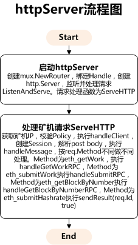
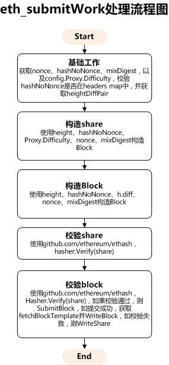

# open-ethereum-pool以太坊矿池-proxy模块

## ProxyServer定义

```go
type ProxyServer struct {
        config             *Config
        blockTemplate      atomic.Value
        upstream           int32
        upstreams          []*rpc.RPCClient
        backend            *storage.RedisClient
        diff               string
        policy             *policy.PolicyServer
        hashrateExpiration time.Duration
        failsCount         int64

        // Stratum
        sessionsMu sync.RWMutex
        sessions   map[*Session]struct{}
        timeout    time.Duration
}
```

## BlockTemplate定义

```go
type BlockTemplate struct {
        sync.RWMutex
        Header               string
        Seed                 string
        Target               string
        Difficulty           *big.Int
        Height               uint64
        GetPendingBlockCache *rpc.GetBlockReplyPart
        nonces               map[string]bool
        headers              map[string]heightDiffPair
}

type heightDiffPair struct {
        diff   *big.Int
        height uint64
}
```

## 以太坊Pow算法原理

```
//以太坊Pow算法可以表示为如下公式：
//RAND(h, n) <= M / d
//其中RAND()表示一个概念函数，代表一系列的复杂运算。 其中h和n为输入，即区块Header的哈希、以及Header中的Nonce。 
//M表示一个极大的数，此处使用2^256-1。 d，为区块难度，即Header中的Difficulty。

//因此在h和n确定的情况下，d越大，挖矿难度越大，即为Difficulty本义。 即不断变更Nonce，使RAND(h, n)满足RAND(h, n) <= M / d，即完成Pow。
```

## NewProxy流程图


## ProxyServer Start流程图



## eth_submitWork处理流程图

即：processShare()



## WriteNodeState原理

```go
//cfg.Proxy.StateUpdateInterval为WriteNodeState定时器，时间为3s
//调取：err := backend.WriteNodeState(cfg.Name, t.Height, t.Difficulty)
func (r *RedisClient) WriteNodeState(id string, height uint64, diff *big.Int) error {
	tx := r.client.Multi()
	defer tx.Close()

	now := util.MakeTimestamp() / 1000
	_, err := tx.Exec(func() error {
		//HSET eth:nodes:main:name main
		tx.HSet(r.formatKey("nodes"), join(id, "name"), id)
		//HSET eth:nodes:main:height height
		tx.HSet(r.formatKey("nodes"), join(id, "height"), strconv.FormatUint(height, 10))
		//HSET eth:nodes:main:difficulty difficulty
		tx.HSet(r.formatKey("nodes"), join(id, "difficulty"), diff.String())
		//HSET eth:nodes:main:lastBeat now
		tx.HSet(r.formatKey("nodes"), join(id, "lastBeat"), strconv.FormatInt(now, 10))
		return nil
	})
	return err
}
```

## WriteBlock原理

```go
//调取：exist, err := s.backend.WriteBlock(login, id, params, shareDiff, h.diff.Int64(), h.height, s.hashrateExpiration)
//s.hashrateExpiration即cfg.Proxy.HashrateExpiration，为3h，即TTL（生命周期） for workers stats，通常等于hashrateLargeWindow
func (r *RedisClient) WriteBlock(login, id string, params []string, diff, roundDiff int64, height uint64, window time.Duration) (bool, error) {
	//写入eth:pow中，并检查是否已存在
	exist, err := r.checkPoWExist(height, params)
	if err != nil {
		return false, err
	}
	// Duplicate share, (nonce, powHash, mixDigest) pair exist
	//已存在
	if exist {
		return true, nil
	}
	tx := r.client.Multi()
	defer tx.Close()

	ms := util.MakeTimestamp()
	ts := ms / 1000 //转换成秒

	cmds, err := tx.Exec(func() error {
		//调取writeShare
		r.writeShare(tx, ms, ts, login, id, diff, window)
		
		//HSET eth:stats lastBlockFound ts
		//Hset 命令用于为哈希表中的字段赋值
		tx.HSet(r.formatKey("stats"), "lastBlockFound", strconv.FormatInt(ts, 10))
		
		//HDEL eth:stats roundShares
		//Hdel 命令用于删除哈希表 key 中的一个或多个指定字段，不存在的字段将被忽略
		tx.HDel(r.formatKey("stats"), "roundShares")
		
		//ZINCRBY eth:finders 1 login
		//Zincrby 命令对有序集合中指定成员的分数加上增量 increment
		tx.ZIncrBy(r.formatKey("finders"), 1, login)
		
		//HINCRBY eth:miners:login blocksFound 1
		//Hincrby 命令用于为哈希表中的字段值加上指定增量值
		tx.HIncrBy(r.formatKey("miners", login), "blocksFound", 1)
		
		//RENAME eth:shares:roundCurrent eth:shares:round&height:nonce
		//Rename 命令用于修改 key 的名称
		tx.Rename(r.formatKey("shares", "roundCurrent"), r.formatRound(int64(height), params[0]))
		
		//HGETALL eth:shares:round&height:nonce
		//Hgetall 命令用于返回哈希表中，所有的字段和值
		tx.HGetAllMap(r.formatRound(int64(height), params[0]))
		return nil
	})
	if err != nil {
		return false, err
	} else {
		//HGETALL eth:shares:round&height:nonce
		//Hgetall 命令用于返回哈希表中，所有的字段和值
		sharesMap, _ := cmds[10].(*redis.StringStringMapCmd).Result()
		totalShares := int64(0)
		for _, v := range sharesMap {
			n, _ := strconv.ParseInt(v, 10, 64)
			totalShares += n
		}
		
		//nonce、powHash、mixDigest
		hashHex := strings.Join(params, ":")
		//MakeTimestamp、h.diff、totalShares
		s := join(hashHex, ts, roundDiff, totalShares)
		//ZADD eth:blocks:candidates height nonce:powHash:mixDigest:MakeTimestamp:h.diff:totalShares
		//Zadd 命令用于将一个或多个成员元素及其分数值加入到有序集当中
		//candidates为候选者
		cmd := r.client.ZAdd(r.formatKey("blocks", "candidates"), redis.Z{Score: float64(height), Member: s})
		return false, cmd.Err()
	}
}

func (r *RedisClient) checkPoWExist(height uint64, params []string) (bool, error) {
        // Sweep PoW backlog for previous blocks, we have 3 templates back in RAM
		//扫描积压的前块
		//ZREMRANGEBYSCORE eth:pow -inf (height-8
		//Zremrangebyscore 命令用于移除有序集中，指定分数（score）区间内的所有成员
        r.client.ZRemRangeByScore(r.formatKey("pow"), "-inf", fmt.Sprint("(", height-8))
		
		//ZADD eth:pow height params
		//Zadd 命令用于将一个或多个成员元素及其分数值加入到有序集当中
        val, err := r.client.ZAdd(r.formatKey("pow"), redis.Z{Score: float64(height), Member: strings.Join(params, ":")}).Result()
        return val == 0, err
}
```

## WriteShare原理

```go
func (r *RedisClient) WriteShare(login, id string, params []string, diff int64, height uint64, window time.Duration) (bool, error) {
	//ZADD eth:pow height params
	//写入eth:pow中，并检查是否已存在
	exist, err := r.checkPoWExist(height, params)
	if err != nil {
		return false, err
	}
	// Duplicate share, (nonce, powHash, mixDigest) pair exist
	//已存在
	if exist {
		return true, nil
	}
	tx := r.client.Multi()
	defer tx.Close()

	ms := util.MakeTimestamp()
	ts := ms / 1000

	_, err = tx.Exec(func() error {
		r.writeShare(tx, ms, ts, login, id, diff, window)
		
		//HINCRBY eth:stats roundShares diff
		//Hincrby 命令用于为哈希表中的字段值加上指定增量值
		tx.HIncrBy(r.formatKey("stats"), "roundShares", diff)
		return nil
	})
	return false, err
}

func (r *RedisClient) writeShare(tx *redis.Multi, ms, ts int64, login, id string, diff int64, expire time.Duration) {
	//HINCRBY eth:shares:roundCurrent login diff
	//Hincrby 命令用于为哈希表中的字段值加上指定增量值
	tx.HIncrBy(r.formatKey("shares", "roundCurrent"), login, diff)
	
	//ZADD eth:hashrate ts diff:login:id:ms
	//Zadd 命令用于将一个或多个成员元素及其分数值加入到有序集当中
	tx.ZAdd(r.formatKey("hashrate"), redis.Z{Score: float64(ts), Member: join(diff, login, id, ms)})
	//ZADD eth:hashrate:login ts diff:login:id:ms
	tx.ZAdd(r.formatKey("hashrate", login), redis.Z{Score: float64(ts), Member: join(diff, id, ms)})
	
	//EXPIRE eth:hashrate:login expire
	//expire即cfg.Proxy.HashrateExpiration，即3小时
	tx.Expire(r.formatKey("hashrate", login), expire) // Will delete hashrates for miners that gone
	
	//HSET eth:miners:login lastShare ts
	//Hset 命令用于为哈希表中的字段赋值
	tx.HSet(r.formatKey("miners", login), "lastShare", strconv.FormatInt(ts, 10))
}
```

## Stratum Mining Protocol

### eth_submitLogin

```json
//Request
{
  "id": 1,
  "jsonrpc": "2.0",
  "method": "eth_submitLogin",
  "params": ["0xb85150eb365e7df0941f0cf08235f987ba91506a"]
}
//或
{
  "id": 1,
  "jsonrpc": "2.0",
  "method": "eth_submitLogin",
  "params": ["0xb85150eb365e7df0941f0cf08235f987ba91506a", "admin@example.net"]
}

//Successful response
{ "id": 1, "jsonrpc": "2.0", "result": true }

//{ "id": 1, "jsonrpc": "2.0", "result": null, "error": { code: -1, message: "Invalid login" } }
```

### eth_getWork

```json
//Request 
{ "id": 1, "jsonrpc": "2.0", "method": "eth_getWork" }

//Successful response
{
  "id": 1,
  "jsonrpc": "2.0",
  "result": [
      "0x1234567890abcdef1234567890abcdef1234567890abcdef1234567890abcdef",
      "0x5eed00000000000000000000000000005eed0000000000000000000000000000",
      "0xd1ff1c01710000000000000000000000d1ff1c01710000000000000000000000"
    ]
}

//Exceptions
{ "id": 10, "result": null, "error": { code: 0, message: "Work not ready" } }
```

### New Job Notification

```json
//New Job Notification
{
  "jsonrpc": "2.0",
  "result": [
      "0x1234567890abcdef1234567890abcdef1234567890abcdef1234567890abcdef",
      "0x5eed00000000000000000000000000005eed0000000000000000000000000000",
      "0xd1ff1c01710000000000000000000000d1ff1c01710000000000000000000000"
    ]
}
```

### eth_submitWork

```json
//Request 
{
  "id": 1,
  "jsonrpc": "2.0",
  "method": "eth_submitWork",
  "params": [
    "0xe05d1fd4002d962f",
    "0x6c872e2304cd1e64b553a65387d7383470f22331aff288cbce5748dc430f016a",
    "0x2b20a6c641ed155b893ee750ef90ec3be5d24736d16838b84759385b6724220d"
  ]
}

//Response
{ "id": 1, "jsonrpc": "2.0", "result": true }
{ "id": 1, "jsonrpc": "2.0", "result": false }

//Exceptions
{ "id": 1, "jsonrpc": "2.0", "result": null, "error": { code: 23, message: "Invalid share" } }
{ "id": 1, "jsonrpc": "2.0", "result": null, "error": { code: 22, message: "Duplicate share" } }
{ "id": 1, "jsonrpc": "2.0", "result": null, "error": { code: -1, message: "High rate of invalid shares" } }
{ "id": 1, "jsonrpc": "2.0", "result": null, "error": { code: 25, message: "Not subscribed" } }
{ "id": 1, "jsonrpc": "2.0", "result": null, "error": { code: -1, message: "Malformed PoW result" } }
```

### Submit Hashrate

```json
{ "id": 1, "jsonrpc": "2.0", "result": true }
```

## Geth JavaScript console

```shell
//getBlock
> eth.getBlock('pending')
{
  author: "0xdda50d9783dfda1c7ac51c4920f3561e17438be7",
  difficulty: 550853386,
  extraData: "0xd5830109048650617269747986312e32342e30826c69",
  gasLimit: 4700036,
  gasUsed: 3933311,
  hash: "0x6615dc650abc224822e3328155f843a5b441d2de11e7bb6dfc8bdecfc22ad3f8",
  logsBloom: "0x02000000000000010000000000000000400000000000800000000000000000000000000000000400000000800000000000000000000000400000000000000000000000001000000000020008000000000000000000000000000000000000000000000000000000000000000000000000000000000000000000000010000000000000000000000000000000000000080000040000004000000004000080000000000000000000000000000000000000000000000000000000000000000000000000000002000000000000000000001000040000000000000000000000000000000000000010000000000000000000000000000000000000000000000000100000",
  miner: "0xdda50d9783dfda1c7ac51c4920f3561e17438be7",
  number: 2753366,
  parentHash: "0x31256e245ce314c0b5cf4007d21b7baebb46e2beb3e6b445809d8bceb1bd3039",
  receiptsRoot: "0x9d89da07e7300f4edc5ef580a6ccbaaffae76a978f9ee4d77fb83a7907a8c508",
  sealFields: [],
  sha3Uncles: "0x1dcc4de8dec75d7aab85b567b6ccd41ad312451b948a7413f0a142fd40d49347",
  size: 2455,
  stateRoot: "0x557340ac77aef679dae4ddef6a426436659a4e1e9588c85fb5da74491d28fe8b",
  timestamp: 1519976198,
  totalDifficulty: 7852523064449795,
  transactions: ["0x715eb518875555fd6abf3cb8e90588222d3be89554a64e2dac72ba58ed729d78", "0xcfbf33be2bd2141cc9d5a5896d2fb99c978a8d75bce59462b645733ff57bcfd0", "0x82eb59d32abb36d2754a48e2e581ec8c9809f9180f7200ea334bcb746365797a", "0xe0d0f519452d4aad44c706aee65e99dce6e3c15876a71daa32e1496e803cf8e5", "0x3731d60c5dd0c1013555312bef2471de0c30978d9ab611f28325addd44492664", "0x0fb9b1fee161632c069068bec45b910dc2cd013480dea5987e1da84e8f779cd7", "0xc5dade656fa25bb044398675851765a8f8182112d7a400e8a0c4e6f4045bd42b", "0xfe41aa0ee9090d623609435b0b8b8e5ab3b6019d79560396956a5f4a5f3c1357", "0xe40c8e78ec16ea4bc1c445749dfaddb6777d6652e9882a5ab8ae48b316cc926e", "0xc08fac21754c516ba3e61c9a6b0a51982c7b680e48c80c04e9572c6e1b2adbb4", "0x2a5d22570373f21f6989b2228d7031d42bdbac13992152e55a95af441e20138a", "0x204b56dd370fe9f73282df925168f6375b5cccb38a681e9cb97855aed2e34aee", "0x5be5b6ea903e66ced2de9674e48639032aad4eca3f970605a3fbb0162e481da3", "0xc35a3b3fab6ae3503287a765497c82f4687f536676c79c87771d1332d0d0d313"],
  transactionsRoot: "0x07bf02d4b8239576682c33d9393998401112dd011b57ac77042fe1981830c3e1",
  uncles: []
}

//getWork
> eth.getWork()
["0x6615dc650abc224822e3328155f843a5b441d2de11e7bb6dfc8bdecfc22ad3f8", "0xcadf16f9c673bb7540bc190a9eed2b04fd59a98a7d4f631d85c240ad6155bfa9", "0x00000007cc03d7d0cb49aa514f6aed05705a9baef46aea9a02514c253e288daa"]
```

## 参考文档

* [eth_getblockbynumber](https://github.com/ethereum/wiki/wiki/JSON-RPC#eth_getblockbynumber)
* [以太币的挖矿机制](http://ethfans.org/topics/18)
* [以太坊ETH挖矿详细教程](https://www.cybtc.com/thread-15905-1-1.html)
* [JavaScript Runtime Environment](https://ethereum.gitbooks.io/frontier-guide/content/jsre.html)
* [Management APIs](https://github.com/ethereum/go-ethereum/wiki/Management-APIs)
* [Pacy-以太坊矿池流程图](https://processon.com/u/58748c7ee4b09f680a4af83e)
* [Stratum Mining Protocol](https://github.com/sammy007/open-ethereum-pool/blob/master/docs/STRATUM.md)
* [JSON-RPC methods](https://github.com/ethereum/wiki/wiki/JSON-RPC#eth_getwork)
* [cpp-ethereum/libethash](https://github.com/ethereum/cpp-ethereum/tree/develop/libethash)
* [Web3.js API 中文文档](http://web3.tryblockchain.org/Web3.js-api-refrence.html)
* [Redis Command 命令](http://www.runoob.com/redis/server-command.html)