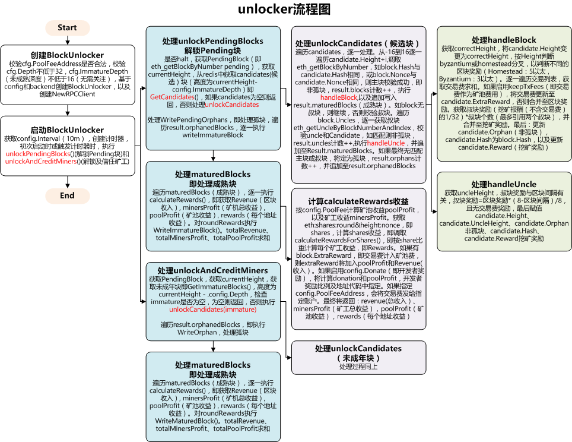

# open-ethereum-pool以太坊矿池-unlocker模块

## unlocker模块配置

```json
"unlocker": {
	"enabled": false,
	"poolFee": 1.0,
	"poolFeeAddress": "",
	"donate": true,
	"depth": 120,
	"immatureDepth": 20,
	"keepTxFees": false,
	"interval": "10m",
	"daemon": "http://127.0.0.1:8545",
	"timeout": "10s"
},
```

## BlockUnlocker定义

```go
type BlockUnlocker struct {
	config   *UnlockerConfig
	backend  *storage.RedisClient
	rpc      *rpc.RPCClient
	halt     bool
	lastFail error
}
```

## unlocker流程图



## GetCandidates原理

```go
func (r *RedisClient) GetCandidates(maxHeight int64) ([]*BlockData, error) {
	//ZRANGEBYSCORE eth:blocks:candidates 0 maxHeight WITHSCORES
	option := redis.ZRangeByScore{Min: "0", Max: strconv.FormatInt(maxHeight, 10)}
	cmd := r.client.ZRangeByScoreWithScores(r.formatKey("blocks", "candidates"), option)
	if cmd.Err() != nil {
		return nil, cmd.Err()
	}
	return convertCandidateResults(cmd), nil
}

func convertCandidateResults(raw *redis.ZSliceCmd) []*BlockData {
	var result []*BlockData
	for _, v := range raw.Val() {
		// "nonce:powHash:mixDigest:timestamp:diff:totalShares"
		block := BlockData{}
		block.Height = int64(v.Score)
		block.RoundHeight = block.Height
		fields := strings.Split(v.Member.(string), ":")
		block.Nonce = fields[0]
		block.PowHash = fields[1]
		block.MixDigest = fields[2]
		block.Timestamp, _ = strconv.ParseInt(fields[3], 10, 64)
		block.Difficulty, _ = strconv.ParseInt(fields[4], 10, 64)
		block.TotalShares, _ = strconv.ParseInt(fields[5], 10, 64)
		block.candidateKey = v.Member.(string)
		result = append(result, &block)
	}
	return result
}
```

## writeImmatureBlock原理

```go
//Immature即未成年
func (r *RedisClient) writeImmatureBlock(tx *redis.Multi, block *BlockData) {
	// Redis 2.8.x returns "ERR source and destination objects are the same"
	if block.Height != block.RoundHeight {
		//RENAME eth:shares:candidates:round&RoundHeight:nonce eth:shares:candidates:round&blockHeight:nonce
		tx.Rename(r.formatRound(block.RoundHeight, block.Nonce), r.formatRound(block.Height, block.Nonce))
	}
	
	//Zrem 命令用于移除有序集中的一个或多个成员，不存在的成员将被忽略
	//candidates为候选者
	//ZREM eth:blocks:candidates nonce:powHash:mixDigest:timestamp:diff:totalShares
	tx.ZRem(r.formatKey("blocks", "candidates"), block.candidateKey)
	
	//ZADD eth:blocks:immature block.Height UncleHeight:Orphan:Nonce:serializeHash:Timestamp:Difficulty:TotalShares:Reward
	tx.ZAdd(r.formatKey("blocks", "immature"), redis.Z{Score: float64(block.Height), Member: block.key()})
}

func (b *BlockData) key() string {
	return join(b.UncleHeight, b.Orphan, b.Nonce, b.serializeHash(), b.Timestamp, b.Difficulty, b.TotalShares, b.Reward)
}
```

## 参考文档

* [以太坊中的叔块(uncle block)](http://blog.csdn.net/superswords/article/details/76445278)